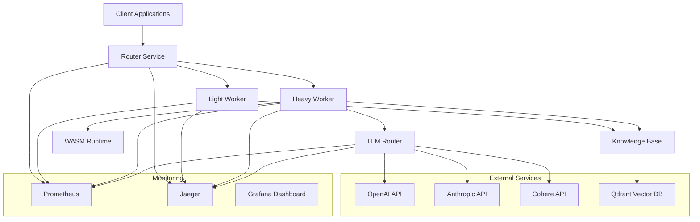
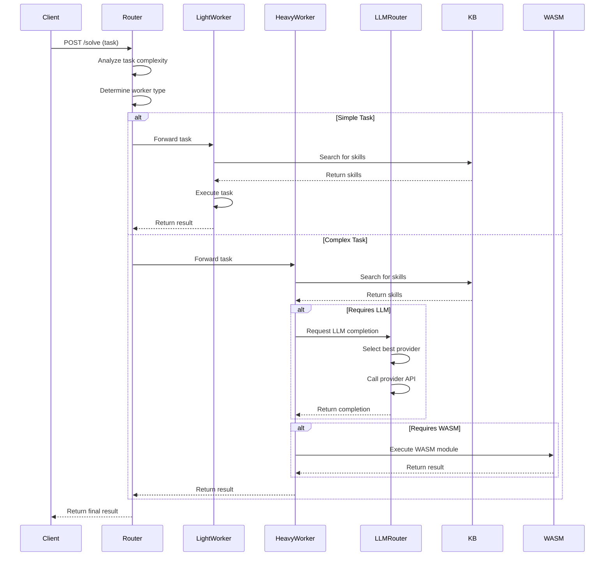
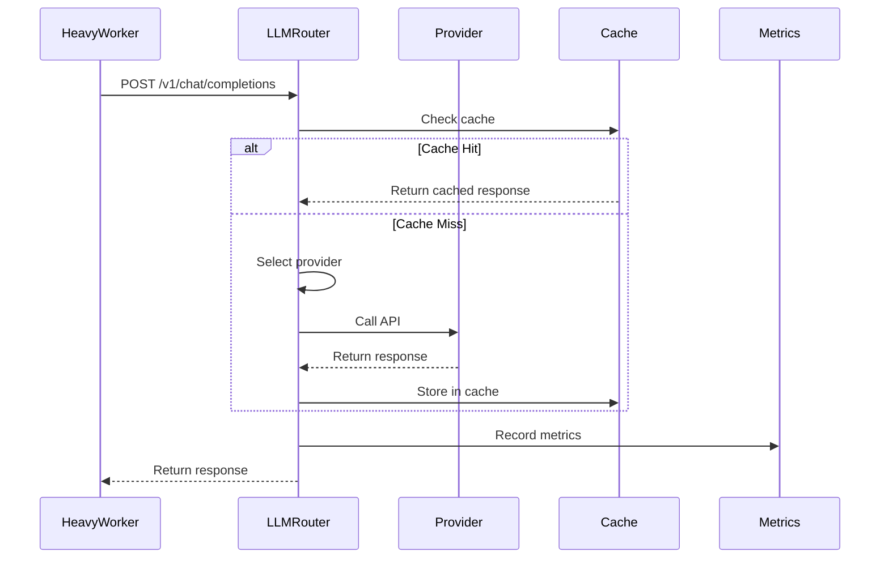

# Agent Architecture Documentation

## Overview

The Agent system is a distributed AI task processing platform that routes and executes tasks using different worker types based on complexity and requirements. The system consists of multiple microservices working together to provide scalable, cost-effective AI task processing.

## System Architecture



## Core Components

### 1. Router Service (`cmd/router`)

**Purpose**: Central routing service that determines which worker should handle a task.

**Key Features**:
- Task complexity analysis
- Worker capability matching
- Load balancing
- Health checking
- Metrics collection

**API Endpoints**:
- `POST /solve` - Route and execute tasks
- `GET /health` - Health check
- `GET /ready` - Readiness check
- `GET /caps` - Worker capabilities
- `GET /metrics` - Prometheus metrics

**Configuration**:
- `LIGHT_WORKER_URL` - URL of light worker
- `HEAVY_WORKER_URL` - URL of heavy worker
- `ROUTER_PORT` - Port to listen on
- `COMPLEXITY_THRESHOLD` - Threshold for heavy worker routing

### 2. Light Worker (`cmd/worker`)

**Purpose**: Handles simple tasks that don't require LLM or WASM capabilities.

**Key Features**:
- Knowledge Base integration
- Fast task execution
- Resource-efficient processing
- Caching support

**Capabilities**:
- ✅ Knowledge Base access
- ❌ WASM execution
- ❌ LLM integration

**Configuration**:
- `WORKER_PORT` - Port to listen on
- `KB_PATH` - Knowledge Base path
- `CACHE_SIZE` - Cache size
- `LOG_LEVEL` - Logging level

### 3. Heavy Worker (`cmd/worker`)

**Purpose**: Handles complex tasks requiring LLM and WASM capabilities.

**Key Features**:
- Knowledge Base integration
- WASM sandbox execution
- LLM integration via LLM Router
- Advanced task processing

**Capabilities**:
- ✅ Knowledge Base access
- ✅ WASM execution
- ✅ LLM integration

**Configuration**:
- `WORKER_PORT` - Port to listen on
- `KB_PATH` - Knowledge Base path
- `WASM_PATH` - WASM modules path
- `LLMROUTER_URL` - LLM Router URL
- `HYPOTHESES_DIR` - Hypotheses storage directory

### 4. LLM Router (`cmd/llmrouter`)

**Purpose**: Routes LLM requests to different providers with load balancing and cost optimization.

**Key Features**:
- Multi-provider support (OpenAI, Anthropic, Cohere)
- Cost-aware routing
- Latency-based routing
- Load balancing
- Circuit breaker pattern
- Rate limiting
- Caching
- Metrics and accounting

**API Endpoints**:
- `POST /v1/chat/completions` - Chat completions
- `POST /v1/embeddings` - Text embeddings
- `GET /v1/models` - Available models
- `GET /health` - Health check
- `GET /metrics` - Prometheus metrics
- `GET /config` - Router configuration

**Configuration**:
- `LLMROUTER_PORT` - Port to listen on
- `OPENAI_API_KEY` - OpenAI API key
- `ANTHROPIC_API_KEY` - Anthropic API key
- `COHERE_API_KEY` - Cohere API key
- `ROUTING_STRATEGY` - Default routing strategy

### 5. Knowledge Base (`kb/`)

**Purpose**: Stores and retrieves skills, artifacts, and domain knowledge.

**Key Features**:
- In-memory registry with persistence
- Vector search with Qdrant integration
- Artifact-based storage
- Optimized search with caching
- Migration support

**Components**:
- `memory/` - In-memory implementation
- `vectordb/` - Vector database integration
- `indexer/` - Indexing and migration utilities

### 6. WASM Interpreter (`interp/wasm/`)

**Purpose**: Executes WebAssembly modules in a sandboxed environment.

**Key Features**:
- wazero runtime integration
- Instance pooling for performance
- Sandboxed execution
- Resource limits
- Metrics collection

## Data Flow

### 1. Task Processing Flow



### 2. LLM Request Flow



## Security Architecture

### Authentication

- **API Key Authentication**: Primary authentication method
- **JWT Tokens**: Optional JWT support for stateless authentication
- **Rate Limiting**: Per-API-key rate limiting
- **Secret Management**: Encrypted secret storage

### Authorization

- **Capability-based**: Workers have different capabilities
- **Resource Limits**: WASM execution limits
- **Cost Controls**: Budget enforcement per task

### Security Features

- **Input Validation**: All inputs are validated
- **Sandboxing**: WASM execution in isolated environment
- **Secret Rotation**: Automatic secret rotation
- **Audit Logging**: Comprehensive audit trails

## Monitoring and Observability

### Metrics

- **Prometheus Integration**: All services expose Prometheus metrics
- **Custom Metrics**: Task-specific metrics
- **Cost Tracking**: LLM usage and cost tracking
- **Performance Metrics**: Latency, throughput, error rates

### Logging

- **Structured Logging**: JSON-formatted logs
- **Trace Correlation**: Trace IDs in logs
- **Log Levels**: Configurable log levels
- **Centralized Logging**: Optional centralized log collection

### Tracing

- **OpenTelemetry**: Distributed tracing
- **Jaeger Integration**: Trace visualization
- **Span Correlation**: Cross-service span correlation
- **Performance Analysis**: Request flow analysis

## Deployment Architecture

### Docker Compose

```yaml
services:
  router:
    build: .
    ports: ["9006:9006", "9007:9007"]
    depends_on: [light-worker, heavy-worker]
  
  light-worker:
    build: .
    ports: ["9004:9004", "9005:9005"]
    depends_on: [qdrant]
  
  heavy-worker:
    build: .
    ports: ["9002:9002", "9003:9003"]
    depends_on: [llmrouter, qdrant]
  
  llmrouter:
    build: .
    ports: ["9000:9000"]
  
  qdrant:
    image: qdrant/qdrant:latest
    ports: ["6333:6333"]
  
  prometheus:
    image: prom/prometheus:latest
    ports: ["9090:9090"]
  
  grafana:
    image: grafana/grafana:latest
    ports: ["3000:3000"]
  
  jaeger:
    image: jaegertracing/all-in-one:latest
    ports: ["16686:16686"]
```

### Kubernetes

```yaml
apiVersion: apps/v1
kind: Deployment
metadata:
  name: agent-router
spec:
  replicas: 3
  selector:
    matchLabels:
      app: agent-router
  template:
    metadata:
      labels:
        app: agent-router
    spec:
      containers:
      - name: router
        image: agent/router:latest
        ports:
        - containerPort: 9006
        env:
        - name: LIGHT_WORKER_URL
          value: "http://light-worker:9004"
        - name: HEAVY_WORKER_URL
          value: "http://heavy-worker:9002"
```

## Configuration Management

### Environment Variables

All services use environment variables for configuration:

```bash
# Router
ROUTER_PORT=9006
LIGHT_WORKER_URL=http://localhost:9004
HEAVY_WORKER_URL=http://localhost:9002
COMPLEXITY_THRESHOLD=5

# Worker
WORKER_PORT=9002
KB_PATH=./kb
CACHE_SIZE=1000
LOG_LEVEL=info

# LLM Router
LLMROUTER_PORT=9000
OPENAI_API_KEY=sk-...
ANTHROPIC_API_KEY=sk-ant-...
COHERE_API_KEY=co-...

# Qdrant
QDRANT_URL=http://localhost:6333
QDRANT_COLLECTION=artifacts
```

### Configuration Files

- `router.yaml` - Router configuration
- `env.example` - Environment variable template
- `docker-compose.yml` - Docker Compose configuration

## Performance Characteristics

### Throughput

- **Light Worker**: ~1000 tasks/second
- **Heavy Worker**: ~100 tasks/second
- **LLM Router**: ~50 requests/second (provider dependent)

### Latency

- **Light Worker**: <10ms average
- **Heavy Worker**: 100ms-5s (depending on LLM/WASM usage)
- **LLM Router**: 200ms-2s (provider dependent)

### Resource Usage

- **Memory**: 100MB-1GB per service
- **CPU**: 0.1-2 cores per service
- **Storage**: 1GB-10GB (depending on KB size)

## Scalability

### Horizontal Scaling

- **Router**: Stateless, can scale horizontally
- **Workers**: Can scale based on load
- **LLM Router**: Can scale based on LLM usage

### Vertical Scaling

- **Memory**: Increase for larger KB
- **CPU**: Increase for more WASM execution
- **Storage**: Increase for more artifacts

## Error Handling

### Error Types

- **Validation Errors**: Invalid input data
- **Authentication Errors**: Invalid API keys
- **Rate Limit Errors**: Too many requests
- **Service Errors**: Internal service failures
- **Timeout Errors**: Task execution timeouts

### Error Recovery

- **Retries**: Automatic retry with exponential backoff
- **Circuit Breaker**: Prevent cascade failures
- **Graceful Degradation**: Fallback to simpler workers
- **Health Checks**: Automatic service recovery

## Future Enhancements

### Planned Features

- **Multi-region Support**: Geographic distribution
- **Advanced Routing**: ML-based routing decisions
- **Custom Providers**: Plugin system for new LLM providers
- **Real-time Monitoring**: WebSocket-based monitoring
- **A/B Testing**: Built-in experimentation framework

### Performance Improvements

- **Connection Pooling**: Optimized HTTP connections
- **WASM Pooling**: Instance reuse for better performance
- **KB Optimization**: Advanced search algorithms
- **Caching**: Multi-level caching strategy
