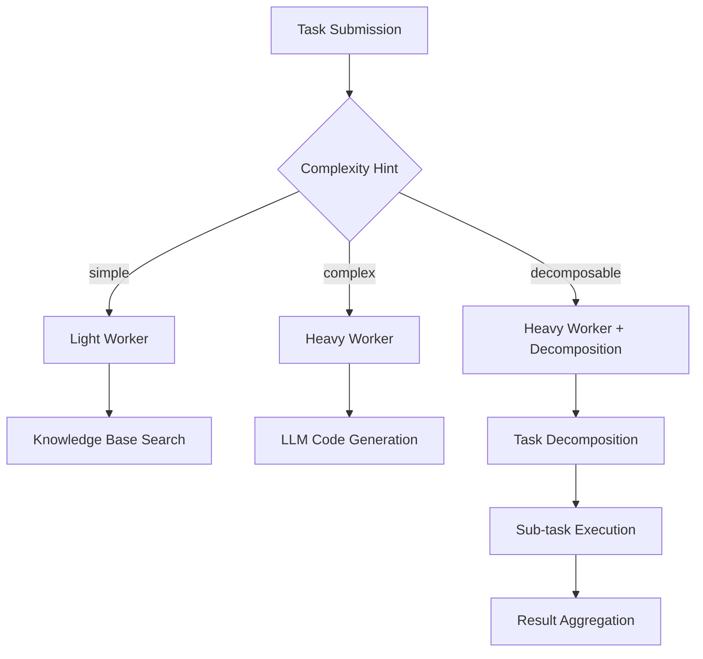

# Test Tasks Documentation

This document describes the test task system for the Agent platform, including task structure, complexity classification, and worker routing behavior.

## Overview

The test task system provides a comprehensive suite of tasks to validate the Agent platform's capabilities across different complexity levels and worker types.

## Task Structure

### Basic Format

All test tasks are JSON files with the following structure:

```json
{
  "id": "task-identifier",
  "domain": "algorithms.category",
  "description": "Human-readable task description",
  "input": {
    "key": "value"
  },
  "spec": {
    "props": {
      "type": "operation_type",
      "input_schema": "JSON schema for input validation",
      "output_schema": "JSON schema for output validation",
      "complexity_hint": "simple|complex|decomposable"
    }
  },
  "budget": {
    "cpu_millis": 5000,
    "mem_mb": 128,
    "timeout": "30s"
  }
}
```

### Field Descriptions

- **id**: Unique identifier for the task
- **domain**: Categorizes the task (e.g., "algorithms.sorting", "algorithms.arrays")
- **description**: Clear description of what the task should accomplish
- **input**: Test data provided to the task
- **spec.props.type**: Type of operation (e.g., "sort", "find_max", "fibonacci")
- **spec.props.input_schema**: JSON schema validating the input format
- **spec.props.output_schema**: JSON schema validating the expected output format
- **spec.props.complexity_hint**: Indicates task complexity for routing decisions
- **budget**: Resource limits for task execution

## Task Categories

### Simple Tasks (`testdata/tasks/simple/`)

Simple tasks are basic operations that can be handled by the light worker:

1. **sort_numbers.json** - Sort an array of numbers
2. **find_max.json** - Find maximum value in array
3. **reverse_array.json** - Reverse array elements
4. **sum_array.json** - Calculate sum of array elements
5. **filter_even.json** - Filter even numbers from array

**Characteristics:**
- Single-step operations
- No LLM or WASM requirements
- Fast execution (< 1 second)
- Low memory usage (< 128MB)

### Complex Tasks (`testdata/tasks/complex/`)

Complex tasks require the heavy worker with LLM capabilities:

1. **fibonacci.json** - Generate Fibonacci sequence
2. **prime_check.json** - Check if number is prime
3. **binary_search.json** - Binary search in sorted array
4. **string_palindrome.json** - Check palindrome with edge cases
5. **matrix_transpose.json** - Transpose 2D matrix

**Characteristics:**
- Single-step but computationally intensive
- May require LLM for code generation
- Moderate execution time (1-60 seconds)
- Higher memory usage (128-512MB)

### Decomposable Tasks (`testdata/tasks/decomposable/`)

Decomposable tasks require worker orchestration and can be broken into sub-tasks:

1. **sort_and_stats.json** - Sort array and compute statistics
2. **text_pipeline.json** - Multi-step text processing pipeline
3. **data_validation_pipeline.json** - Data validation and transformation
4. **search_filter_sort.json** - Filter, sort, and paginate data
5. **multi_array_ops.json** - Multiple array operations in sequence

**Characteristics:**
- Multi-step operations
- Require task decomposition
- May use both light and heavy workers
- Longer execution time (30-120 seconds)
- Variable memory usage

## Worker Routing

### Routing Logic

The router determines which worker handles a task based on:

1. **Complexity Hint**: Primary routing signal
   - `simple` → Light Worker
   - `complex` → Heavy Worker
   - `decomposable` → Heavy Worker (with decomposition)

2. **Resource Requirements**: Budget constraints
   - CPU time, memory, timeout limits
   - Worker capacity and current load

3. **Capabilities**: Worker feature support
   - Light Worker: Knowledge Base only
   - Heavy Worker: Knowledge Base + LLM + WASM

### Worker Assignment



## Creating New Test Tasks

### Step 1: Choose Category

Determine the appropriate category based on complexity:

- **Simple**: Basic operations, no LLM needed
- **Complex**: Single complex operation, LLM required
- **Decomposable**: Multi-step process, orchestration needed

### Step 2: Define Task Structure

```json
{
  "id": "my-task",
  "domain": "algorithms.my_category",
  "description": "Clear description of what this task does",
  "input": {
    "param1": "value1",
    "param2": "value2"
  },
  "spec": {
    "props": {
      "type": "my_operation",
      "input_schema": "{\"type\": \"object\", \"properties\": {...}}",
      "output_schema": "{\"type\": \"object\", \"properties\": {...}}",
      "complexity_hint": "simple"
    }
  },
  "budget": {
    "cpu_millis": 5000,
    "mem_mb": 128,
    "timeout": "30s"
  }
}
```

### Step 3: Add Sub-tasks (for decomposable tasks)

```json
{
  "spec": {
    "props": {
      "complexity_hint": "decomposable",
      "sub_tasks": [
        "step1_operation",
        "step2_operation",
        "step3_operation"
      ]
    }
  }
}
```

### Step 4: Test the Task

```bash
# Test individual task
make run-task-custom TASK=./testdata/tasks/my_category/my_task.json

# Test with verbose output
go run ./cmd/task-runner -task ./testdata/tasks/my_category/my_task.json -verbose
```

## Running Test Suites

### Individual Categories

```bash
# Simple tasks
make test-simple

# Complex tasks
make test-complex

# Decomposable tasks
make test-decomposable
```

### All Tasks

```bash
# Run all tests
make test-all-tasks

# With verbose output
make test-all-tasks-verbose

# Generate JSON report
make test-all-tasks-report
```

### Docker Integration

```bash
# Full Docker test cycle
make docker-test-full

# Setup only
make docker-test-setup

# Cleanup
make docker-test-cleanup
```

## Test Results

### Success Criteria

A task is considered successful if:

1. **Execution**: Task completes without errors
2. **Output**: Produces valid output matching the schema
3. **Performance**: Stays within budget constraints
4. **Worker Assignment**: Correct worker handles the task

### Reporting

Test results include:

- **Task ID**: Identifier of the task
- **Success**: Boolean success/failure
- **Worker**: Which worker handled the task
- **Duration**: Execution time
- **Error**: Error message if failed
- **Output**: Task output (if successful)

### Example Report

```json
{
  "total_tests": 15,
  "passed_tests": 14,
  "failed_tests": 1,
  "total_duration": "2m30s",
  "worker_stats": {
    "light": 5,
    "heavy": 9,
    "unknown": 1
  },
  "results": [
    {
      "task_id": "sort-numbers",
      "success": true,
      "worker": "light",
      "duration": "150ms"
    }
  ]
}
```

## Best Practices

### Task Design

1. **Clear Descriptions**: Write descriptive task descriptions
2. **Realistic Inputs**: Use realistic test data
3. **Appropriate Budgets**: Set reasonable resource limits
4. **Schema Validation**: Define strict input/output schemas

### Testing Strategy

1. **Start Simple**: Begin with simple tasks
2. **Progressive Complexity**: Gradually increase complexity
3. **Edge Cases**: Include boundary conditions
4. **Performance Testing**: Monitor execution times

### Maintenance

1. **Regular Updates**: Keep tasks current with system changes
2. **Documentation**: Maintain clear documentation
3. **Version Control**: Track task changes over time
4. **CI Integration**: Include in automated testing

## Troubleshooting

### Common Issues

1. **Task Not Found**: Check file path and JSON syntax
2. **Schema Validation**: Verify input/output schemas
3. **Worker Assignment**: Check complexity hints
4. **Resource Limits**: Adjust budget constraints

### Debugging

```bash
# Verbose task execution
go run ./cmd/task-runner -task path/to/task.json -verbose

# Check worker capabilities
curl http://localhost:9006/caps

# Monitor worker logs
docker-compose logs -f light-worker
docker-compose logs -f heavy-worker
```
